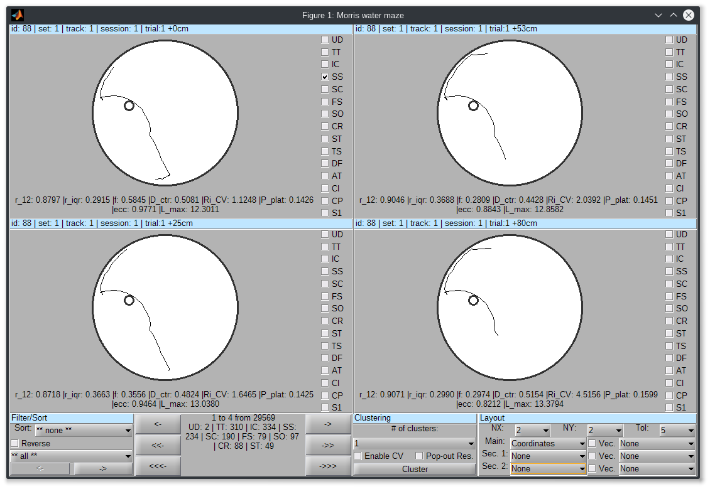

# Introduction

This repository hosts code that can be used to analyse the trajectories of animals be means of a semi-supervised clustering algorithm. 

For more details of the analysis procedure, as applied to trajectories in the Morris Water Maze, please refer to Gehring et al., 2015. The data used in this article is also provided here as an example application of the code (data/mwm_peripubertal_stress folder).

Please note that, althogh this code was initialy applied to trajectories in the Morris Water Maze, the method is general enough as to be applied to other types of experiment. 

## Provided functions

Following main functionallity is provided in this repository:

- A graphical user interface (GUI) for browsing and tagging trajectories or segments of trajectories (gui/browse_trajectories.m). From the GUI a secondary window providing multiple data visualizations (such as individual feature values and clusters) can be accessed. The GUI can also start the semi-supervised clustering algorithm used to classify similar trajectories/segments;

- Semi-supervided clustering algorithm (semisupervised_clustering.m): this class is a frontend for the MPCKmeans semi-supervised algorithm. It uses manually labelled data (provided as mapping from trajectory segments to of one or more behavioural classes) to define *must-link* and *cannot-link* constracints. Again, for more details see the reference above. 

- Plotting routines for plotting trajectories (plot_trajectory.m) or the classification results in the form of color bars (one color for each behavioural class) for each trajectory (plot_distribution_strategies.m);

- Various other functions for analyzing and validating the clustering results. These are spread over a set of classes (e.g. trajectories, connfusion_matrix, clustering_resuls). See the results/mwm folder for examples on how to use those functions (the functions in this folder were used to generate the results and figures used in the publication referenced above which compared the behaviour of stressed and non-stressed rats in the MWM).

# Using the code

In order to open the GUI with the default configuration loaded (using the data from the paper above) run *initialize* and then *browse_set(2,0)*. The former command is used to initialize the environment and load the Java package that implements the clustering algorithm. The latter command opens the GUI using the configuration number 2 (segmented swimming paths) without any reference configuration (which can specified to compare results). 

# Using the GUI

TODO

# Extending and adapting the code

To adapt the code for other experiments a configuration file has to be provided. This configuration is merelly a global object containing some variables and methods which is then referenced by various parts of the code. The configuration file is also used to define the data loading function, segmentation methods of the swimming paths and features used in during the clustering procedure. See config/morris_water_maze/config_mwm.m for an example of such a file (this is the configuration used for the analyzes in the aforementioned publication).

Before running any routines provided here please call the *initialize* function first. This function has to also be changed accorfingly with the desired configuration file that is to be used.

For more information feel free to contact Tiago Gehring (tiagogehring@gmail.com).
